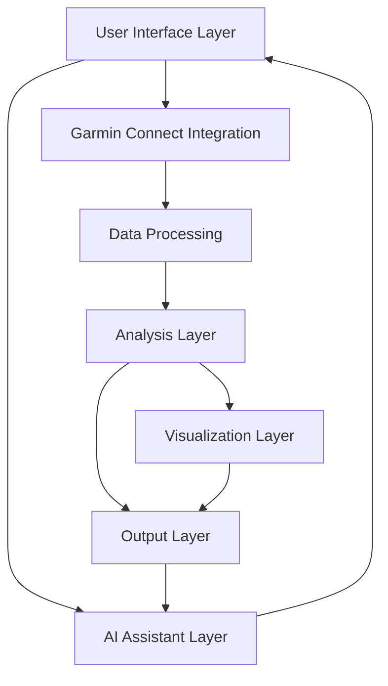

# RunningGPT System Architecture Document

## 1. System Overview
RunningGPT is an intelligent running analysis and coaching application that integrates with Garmin Connect to download workout data, processes it through a comprehensive analysis pipeline, and provides AI-powered insights and recommendations through a modern web-based interface.

## 2. Architecture Components

### 2.1 User Interface Layer
- Web-based GUI (HTML/CSS/JavaScript)
- Authentication Interface
- Activity Selection Interface
- Workout Selection Interface
- Results Display Interface
- AI Assistant Chat Interface
- Test Mode Interface

### 2.2 Garmin Connect Integration Layer
- Authentication Module
- Workout List Retrieval
- FIT File Downloader
- Session Manager
- Rate Limiter

### 2.3 Data Processing Layer
- FIT File Decoder
- CSV Converter
- Data Validation Module
- File Management System
- Cache Manager

### 2.4 Analysis Layer
- Statistical Analysis Engine
- Pace Calculation Module
- Heart Rate Analysis Module
- Altitude Analysis Module
- Batch Processing Engine

### 2.5 Visualization Layer
- Matplotlib Integration
- Plot Generation Module
- Custom Formatting Engine
- Multi-workout Visualization

### 2.6 AI Assistant Layer
- OpenAI API Integration
- System Prompt Management
- Context Management
- Response Generation
- Conversation History

### 2.7 Output Layer
- Report Generation Module
- File Export Handler
- Data Storage Manager
- Backup System

## 3. Component Interactions

## 4. Data Flow

### 4.1 User Interface Flow
1. User authentication
2. Activity type selection
3. Workout count selection
4. Processing initiation
5. Results display
6. AI Assistant interaction

### 4.2 Garmin Connect Integration
1. User authentication
2. Workout list retrieval
3. FIT file download
4. Local storage

### 4.3 Data Processing
1. FIT file decoding
2. CSV conversion
3. Data validation
4. Cache management

### 4.4 Analysis Pipeline
1. Raw data normalization
2. Statistical calculations
3. Pace computations
4. Heart rate analysis
5. Altitude processing
6. Multi-workout aggregation

### 4.5 AI Assistant Processing
1. Workout report loading
2. System prompt creation
3. User message analysis
4. OpenAI API request
5. Response generation
6. Context management

### 4.6 Output Generation
1. Plot creation
2. Report compilation
3. File export
4. Backup creation

## 5. Technical Stack
- Python 3.11/3.12
- Web-based GUI (HTML/CSS/JavaScript)
- garminconnect for API integration
- fitparse for FIT file handling
- pandas for data processing
- numpy for numerical computations
- matplotlib for visualization
- requests for API communication
- cryptography for secure storage
- OpenAI API for AI Assistant
- pytest for unit testing

## 6. Security Considerations
- Secure credential storage
- API rate limiting
- Session token management
- Data encryption at rest
- Secure file handling
- Error handling and logging
- Access control
- OpenAI API key protection

## 7. Performance Optimization
- Connection pooling
- Response caching
- Batch processing
- Concurrent downloads
- Memory management
- File system optimization
- AI response caching
- Plot generation optimization

## 8. Error Handling
- API timeout recovery
- Connection retry logic
- Data validation
- File system errors
- Processing failures
- Logging and monitoring
- GUI error recovery
- AI Assistant fallback

## 9. Test Mode
- Authentication bypass
- Pre-loaded workout data
- Direct access to results
- Pre-initialized AI Assistant
- Simplified workflow for testing

## 10. Version History
| Version | Date | Description | Author |
|---------|------|-------------|---------|
| 1.0 | 2025-04-03 | Initial architecture design | System Architect |
| 1.1 | 2025-04-05 | Added Garmin Connect integration | System Architect |
| 1.2 | 2025-04-06 | Added GUI and AI Assistant components | System Architect |
| 1.3 | 2025-04-07 | Added test mode functionality | System Architect | 