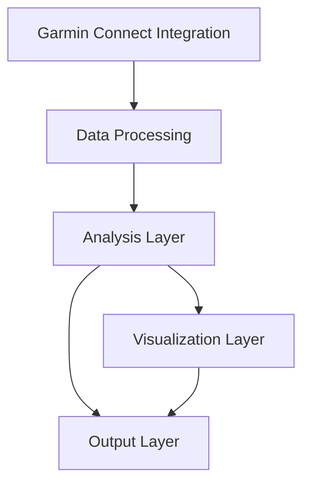

# System Architecture Document

## 1. System Overview
The Running Analysis Application is designed to integrate with Garmin Connect, download FIT files, convert them to CSV format, and provide comprehensive analysis and visualization of workout data.

## 2. Architecture Components

### 2.1 Garmin Connect Integration Layer
- Authentication Module
- Workout List Retrieval
- FIT File Downloader
- Session Manager
- Rate Limiter

### 2.2 Data Processing Layer
- FIT File Decoder
- CSV Converter
- Data Validation Module
- File Management System
- Cache Manager

### 2.3 Analysis Layer
- Statistical Analysis Engine
- Pace Calculation Module
- Heart Rate Analysis Module
- Altitude Analysis Module
- Batch Processing Engine

### 2.4 Visualization Layer
- Matplotlib Integration
- Plot Generation Module
- Custom Formatting Engine
- Multi-workout Visualization

### 2.5 Output Layer
- Report Generation Module
- File Export Handler
- Data Storage Manager
- Backup System

## 3. Component Interactions

## 4. Data Flow

### 4.1 Garmin Connect Integration
1. User authentication
2. Workout list retrieval
3. FIT file download
4. Local storage

### 4.2 Data Processing
1. FIT file decoding
2. CSV conversion
3. Data validation
4. Cache management

### 4.3 Analysis Pipeline
1. Raw data normalization
2. Statistical calculations
3. Pace computations
4. Heart rate analysis
5. Altitude processing
6. Multi-workout aggregation

### 4.4 Output Generation
1. Plot creation
2. Report compilation
3. File export
4. Backup creation

## 5. Technical Stack
- Python 3.x
- garminconnect for API integration
- fitparse for FIT file handling
- pandas for data processing
- numpy for numerical computations
- matplotlib for visualization
- requests for API communication
- cryptography for secure storage

## 6. Security Considerations
- Secure credential storage
- API rate limiting
- Session token management
- Data encryption at rest
- Secure file handling
- Error handling and logging
- Access control

## 7. Performance Optimization
- Connection pooling
- Response caching
- Batch processing
- Concurrent downloads
- Memory management
- File system optimization

## 8. Error Handling
- API timeout recovery
- Connection retry logic
- Data validation
- File system errors
- Processing failures
- Logging and monitoring

## 9. Version History
| Version | Date | Description | Author |
|---------|------|-------------|---------|
| 1.0 | 2024-03-20 | Initial architecture design | System Architect |
| 1.1 | 2024-03-21 | Added Garmin Connect integration | System Architect | 