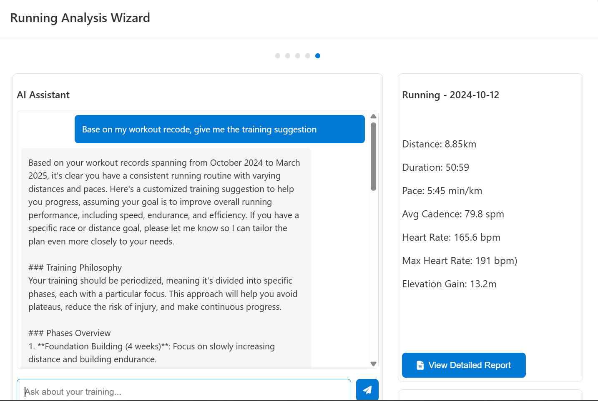
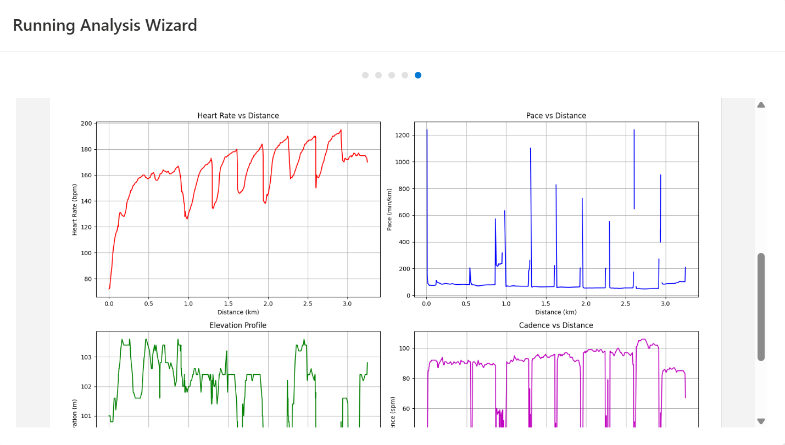

# RunningGPT - Your AI Running Coach

RunningGPT is an intelligent running analysis and coaching application that combines Garmin Connect data with OpenAI's GPT to provide personalized training insights and recommendations.






## Prerequisites

1. **Python Installation**
   - Download and install Python from [python.org](https://www.python.org/downloads/)
   - During installation, make sure to check "Add Python to PATH"
   - Recommended Python version: 3.11 or 3.12

2. **OpenAI API Key**
   - Sign up for an OpenAI account at [platform.openai.com](https://platform.openai.com)
   - Generate an API key from your OpenAI dashboard
   - Configure the API key in the application (see Configuration section)

3. **Visual C++ Build Tools** (Required for Windows)
   - Download from [Visual Studio Build Tools](https://visualstudio.microsoft.com/visual-cpp-build-tools/)
   - During installation, select "Desktop development with C++"
   - Required components:
     - MSVC v143 build tools
     - Windows 10/11 SDK
     - C++ CMake tools
    **Why are C++ Build Tools Required?**
   > - This project depends on `withings-sync`, which in turn requires `lxml`
   > - `lxml` is a Python library that wraps the C libraries `libxml2` and `libxslt`
   > - When installing `lxml` from source, it needs to compile these C extensions, requiring C++ build tools
   > - If you want to avoid installing C++ build tools, you can use pre-built wheels:
   >   ```powershell
   >   pip install --only-binary :all: lxml
   >   ```
   > - Or follow the alternative installation methods in the Troubleshooting section

## Installation

1. **Create and activate virtual environment**
```
# Windows powershell
python -m venv .venv
.\.venv\Scripts\activate


# Linux/Mac
python -m venv .venv
source .venv/bin/activate
```

2. **Install dependencies**
```bash
pip install -r requirements.txt
```


## Configuration

1. **OpenAI API Setup**
   - Locate the `config.ini` file in the root directory
   - Replace `YOUR_API_KEY` with your actual OpenAI API key:
   ```config.ini
      [OpenAI]
      #Replace YOUR_API_KEY with your actual OpenAI API key
      api_key = YOUR_API_KEY with your actual OpenAI API key
      [App]
      # Model to use for chat completion
      model = gpt-4o-2024-08-06
      #Maximum tokens for response
      max_tokens = 1000
      #Temperature for response generation (0.0 - 1.0)
      temperature = 0.7 
   ```
   - Save the file

2. **Application Settings**
   - The `config.ini` file also contains other settings you can customize:
     - `model`: The OpenAI model to use (default: gpt-4-turbo-preview)
     - `max_tokens`: Maximum response length (default: 1000)
     - `temperature`: Response creativity (0.0-1.0, default: 0.7)

## Running the Application

1. **Start the GUI Application**
```bash
# Windows powershell
python -m venv .venv
.\.venv\Scripts\activate
python gui/main.py

# Linux/Mac
python -m venv .venv
source .venv/bin/activate
python gui/main.py
```

2. **Using the AI Assistant**
   - Navigate through the wizard steps to analyze your running data
   - Use the AI chat feature to:
     - Discuss your training goals
     - Get personalized recommendations
     - Analyze your workout patterns
     - Receive training plans

## Features

- **Data Analysis**: Automatically processes your Garmin Connect running data
- **Visual Reports**: Generates detailed plots and statistics for each workout
- **AI Coach**: Provides personalized training advice using OpenAI's GPT
- **Progress Tracking**: Monitors your improvement over time
- **Custom Training Plans**: Receives AI-generated training recommendations

## Security Note

- Keep your OpenAI API key secure and never share it
- The `config.ini` file is included in `.gitignore` to prevent accidental exposure
- Regularly rotate your API key if you suspect it has been compromised


## About

This package allows you to request garmin device, activity and health data from your Garmin Connect account.
See <https://connect.garmin.com/>

## Installation

### Prerequisites

1. **Python Installation**
   - Download and install Python from [python.org](https://www.python.org/downloads/)
   - During installation, make sure to check "Add Python to PATH"
   - Recommended Python version: 3.11 or 3.12 (Python 3.13 may have compatibility issues)

2. **Visual C++ Build Tools** (Required for Windows)
   - Download from [Visual Studio Build Tools](https://visualstudio.microsoft.com/visual-cpp-build-tools/)
   - During installation, select "Desktop development with C++"
   - Required components:
     - MSVC v143 build tools
     - Windows 10/11 SDK
     - C++ CMake tools
   
   > **Why are C++ Build Tools Required?**
   > - This project depends on `withings-sync`, which in turn requires `lxml`
   > - `lxml` is a Python library that wraps the C libraries `libxml2` and `libxslt`
   > - When installing `lxml` from source, it needs to compile these C extensions, requiring C++ build tools
   > - If you want to avoid installing C++ build tools, you can use pre-built wheels:
   >   ```powershell
   >   pip install --only-binary :all: lxml
   >   ```
   > - Or follow the alternative installation methods in the Troubleshooting section

### Dependencies

This project has several key dependencies:

1. **Core Dependencies**
   - `garth>=0.4.45`: For Garmin Connect authentication
   - `requests`: For making HTTP requests
   - `readchar`: For command-line interface

2. **Data Processing Dependencies**
   - `withings-sync>=4.2.4`: For data synchronization
     - Requires `lxml` for XML processing
     - `lxml` needs C++ build tools for compilation from source

3. **Development Dependencies**
   - `pytest`: For testing
   - `pytest-vcr`: For recording HTTP interactions
   - `pytest-cov`: For test coverage
   - `coverage`: For code coverage reporting


>>>>>>> Stashed changes
### Understanding Virtual Environments

If you're new to Python, you might wonder why we use virtual environments. Here's why they're important:

1. **What is a Virtual Environment?**
   - A virtual environment is like a separate, isolated container for your Python project
   - It has its own Python interpreter and package installations
   - It keeps your project's dependencies separate from other projects and your system Python

2. **Why Use Virtual Environments?**
   - **Isolation**: Different projects might need different versions of the same package
     - Project A might need `requests==2.28.0`
     - Project B might need `requests==2.31.0`
     - Without virtual environments, you can only install one version globally
   
   - **Clean Environment**: Prevents conflicts between project dependencies
     - No interference from globally installed packages
     - Easy to recreate the exact same environment on another computer
   
   - **Project Portability**: Makes it easier to share your project
     - All dependencies are listed in requirements files
     - Others can recreate your exact environment
   
   - **System Protection**: Prevents messing up your system Python installation
     - Experiments and 
     
     s are contained within the virtual environment
     - Easy to delete and recreate if something goes wrong

3. **When to Use Virtual Environments?**
   - It's recommended to use a virtual environment for EVERY Python project
   - This project specifically requires certain package versions to work correctly
   - Virtual environments ensure these requirements don't conflict with other projects


## Configuration

1. **OpenAI API Setup**
   - Locate the `config.ini` file in the root directory
   - Replace `YOUR_API_KEY` with your actual OpenAI API key:
   ```config.ini
      [OpenAI]
      #Replace YOUR_API_KEY with your actual OpenAI API key
      api_key = YOUR_API_KEY with your actual OpenAI API key
      [App]
      # Model to use for chat completion
      model = gpt-4o-2024-08-06
      #Maximum tokens for response
      max_tokens = 1000
      #Temperature for response generation (0.0 - 1.0)
      temperature = 0.7 
   ```
   - Save the file

2. **Application Settings**
   - The `config.ini` file also contains other settings you can customize:
     - `model`: The OpenAI model to use 
     - `max_tokens`: Maximum response length (default: 1000)
     - `temperature`: Response creativity (0.0-1.0, default: 0.7)

## Running the Application

1. **Start the GUI Application**
```
# Windows powershell
python -m venv .venv
.\.venv\Scripts\activate
python gui/main.py

# Linux/Mac
python -m venv .venv
source .venv/bin/activate
python gui/main.py
```

2. **Test Mode**
```bash
# Run the application in test mode to skip authentication and directly view results
python gui/main.py --test

# The test mode will:
# - Skip the authentication process
# - Load existing workout data
# - Jump directly to the results page
# - Display workout cards and analysis
```

3. **Using the AI Assistant**
   - Navigate through the wizard steps to analyze your running data
   - Use the AI chat feature to:
     - Discuss your training goals
     - Get personalized recommendations
     - Analyze your workout patterns
     - Receive training plans

## Features

- **Data Analysis**: Automatically processes your Garmin Connect running data
- **Visual Reports**: Generates detailed plots and statistics for each workout
- **AI Coach**: Provides personalized training advice using OpenAI's GPT
- **Progress Tracking**: Monitors your improvement over time
- **Custom Training Plans**: Receives AI-generated training recommendations

## Security Note

- Keep your OpenAI API key secure and never share it
- The `config.ini` file is included in `.gitignore` to prevent accidental exposure
- Regularly rotate your API key if you suspect it has been compromised


 

### Dependencies remark

This project has several key dependencies:

1. **Core Dependencies**
   - `garth>=0.4.45`: For Garmin Connect authentication
   - `requests`: For making HTTP requests
   - `readchar`: For command-line interface

2. **Data Processing Dependencies**
   - `withings-sync>=4.2.4`: For data synchronization
     - Requires `lxml` for XML processing
     - `lxml` needs C++ build tools for compilation from source

3. **Development Dependencies**
   - `pytest`: For testing
   - `pytest-vcr`: For recording HTTP interactions
   - `pytest-cov`: For test coverage
   - `coverage`: For code coverage reporting

**For Traditional Chinese Windows Users (or if you encounter encoding errors)**
```powershell
# Set UTF-8 encoding for pip
$env:PYTHONUTF8=1

# Install lxml first (to avoid compilation issues)
pip install lxml


# Install other dependencies
pip install garth==0.4.46 requests==2.31.0 python-dotenv
pip install withings-sync==4.2.7 --no-deps
pip install readchar>=4.0.0 mypy>=1.8.0
pip install -r requirements-dev.txt
```

3. **For Other Windows Users**
```powershell
# Regular installation
pip install -r requirements.txt
pip install -r requirements-dev.txt
pip install -r requirements-test.txt
```

4. **Verify Installation**
```powershell
# Check if packages are installed correctly
pip list
```

#### Troubleshooting Windows Installation

1. **Encoding Errors**
   - If you see Chinese characters or encoding errors during installation
   - Use the Traditional Chinese Windows installation method above
   - Always set `$env:PYTHONUTF8=1` before running pip commands

2. **lxml Installation Issues**
   - If lxml fails to install:
     - Make sure you have Visual C++ Build Tools installed
     - Or use `pip install lxml --only-binary :all:` to install pre-built wheels
     - For Python 3.13, use lxml 5.3.1 or newer

3. **withings-sync Installation Issues**
   - If withings-sync fails to install:
     - Install its dependencies separately as shown in the Traditional Chinese Windows steps
     - Make sure to install withings-sync with `--no-deps` flag
     - Version conflicts warnings are normal and can be ignored

#### Linux/macOS
```bash
pip3 install garminconnect
```

## Authentication

The library uses the same authentication method as the app using [Garth](https://github.com/matin/garth).
The login credentials generated with Garth are valid for a year to avoid needing to login each time.  
NOTE: We obtain the OAuth tokens using the consumer key and secret as the Connect app does.
`garth.sso.OAUTH_CONSUMER` can be set manually prior to calling api.login() if someone wants to use a custom consumer key and secret.

### Authentication Methods

1. **Environment Variables** (Recommended)
   - Most secure method
   - Credentials are not stored in plain text files
   - See setup instructions below

2. **USERNAMEPASSWORD.txt** (For Development Only)
   - Create a file named `USERNAMEPASSWORD.txt` in your project root directory
   - Add your credentials in this format:
     ```
     email:your_garmin_email
     password:your_garmin_password
     ```
   
   > **⚠️ Security Warning**
   > - This method stores credentials in plain text
   > - NEVER commit this file to version control
   > - NEVER share this file with others
   > - For development/testing only
   > 
   > **How to Protect Your Credentials:**
   > 1. Add `USERNAMEPASSWORD.txt` to your `.gitignore` file
   > 2. Use file system permissions to restrict access:
   >    ```powershell
   >    # Windows (PowerShell)
   >    $acl = Get-Acl "USERNAMEPASSWORD.txt"
   >    $acl.SetAccessRuleProtection($true, $false)
   >    $rule = New-Object System.Security.AccessControl.FileSystemAccessRule("$env:USERNAME","FullControl","Allow")
   >    $acl.AddAccessRule($rule)
   >    Set-Acl "USERNAMEPASSWORD.txt" $acl
   >    ```
   >    ```bash
   >    # Linux/macOS
   >    chmod 600 USERNAMEPASSWORD.txt
   >    ```
   > 3. Consider using environment variables in production

3. **Interactive Login**
   - If no credentials are provided through the above methods
   - The script will prompt you to enter credentials manually

   
4. **Environment Variables** (Optional, for development)
   You can set environment variables to avoid entering credentials repeatedly during development:

### Setting Environment Variables

#### Windows (PowerShell)
```powershell
# Temporary (current session only)
$env:EMAIL="your_garmin_email"
$env:PASSWORD="your_garmin_password"
$env:GARMINTOKENS="C:\Users\$env:USERNAME\.garminconnect"

# Permanent (through System Properties)
 1. Press Windows + R
 2. Type "sysdm.cpl" and press Enter
 3. Go to "Advanced" tab
 4. Click "Environment Variables"
 5. Under "User variables", click "New"
 6. Add each variable (EMAIL, PASSWORD, GARMINTOKENS)
```

#### Linux/macOS
```bash
export EMAIL=<your garmin email>
export PASSWORD=<your garmin password>
export GARMINTOKENS=~/.garminconnect
```

## Testing

### Prerequisites for Testing
Before running tests, make sure you have:
1. All test dependencies installed:
   ```powershell
   pip install pytest pytest-vcr pytest-cov coverage
   ```
2. The `GARMINTOKENS` environment variable set:
   ```powershell
   # Windows (PowerShell)
   $env:GARMINTOKENS="C:\Users\$env:USERNAME\.garminconnect"
   
   # Linux/macOS
   export GARMINTOKENS=~/.garminconnect
   ```

### Running Tests

#### Windows
```powershell
# Make sure you're in your virtual environment
.\.venv\Scripts\activate

# Set environment variable and run tests in one command
$env:GARMINTOKENS="C:\Users\$env:USERNAME\.garminconnect"; python -m pytest tests/

# Or set environment variable permanently (recommended for development):
# 1. Open System Properties (Windows + R, type sysdm.cpl)
# 2. Go to Advanced tab -> Environment Variables
# 3. Under User variables, add GARMINTOKENS with value C:\Users\YOUR_USERNAME\.garminconnect
```

#### Linux/macOS
```bash
# Set environment variable
export GARMINTOKENS=~/.garminconnect

# Install pytest if needed
sudo apt install python3-pytest  # needed on some distros

# Run tests
make install-test
make test
```

### Troubleshooting Tests

1. **Missing GARMINTOKENS Environment Variable**
   If you see this error:
   ```
   AssertionError: assert 'GARMINTOKENS' in environ(...)
   ```
   Make sure to set the GARMINTOKENS environment variable as shown above.

2. **Test Dependencies**
   If you encounter missing package errors:
   ```powershell
   pip install pytest pytest-vcr pytest-cov coverage
   ```

3. **VCR Cassette Errors**
   If tests fail due to VCR cassette issues:
   - Delete the `tests/cassettes` directory
   - Run the tests again to generate new cassettes

## Development

### Windows
```powershell
# Create virtual environment
python -m venv .venv
.\.venv\Scripts\activate

# Install development tools
pip install pdm ruff pre-commit isort black mypy

# Initialize PDM
pdm init
```

### Linux/macOS
```bash
make .venv
source .venv/bin/activate
pip3 install pdm ruff pre-commit isort black mypy
pdm init
```

## Troubleshooting

### Common Issues and Solutions

1. **PowerShell Execution Policy Error**
   ```powershell
   # Run as Administrator and execute:
   Set-ExecutionPolicy RemoteSigned -Scope CurrentUser
   ```

2. **lxml Installation Error**
   ```powershell
   # If you see compilation errors, use pre-built wheels:
   pip install --only-binary :all: lxml
   ```

   If you see errors about missing libxml2 or libxslt:
   ```powershell
   # First, install the required libraries using conda
   # Install Miniconda from: https://docs.conda.io/en/latest/miniconda.html
   
   # Create a new conda environment
   conda create -n garmin python=3.11
   conda activate garmin
   
   # Install lxml and its dependencies
   conda install lxml
   
   # Then install withings-sync
   pip install withings-sync
   ```

   Alternative approach without conda:
   ```powershell
   # Install the latest version of lxml using pre-built wheels
   pip install --only-binary :all: lxml
   
   # Then install withings-sync without its lxml dependency
   pip install --no-deps withings-sync
   ```

   If you still encounter issues, try installing the Visual C++ Build Tools:
   1. Download [Visual Studio Build Tools](https://visualstudio.microsoft.com/visual-cpp-build-tools/)
   2. Run the installer
   3. Select "Desktop development with C++"
   4. Make sure these components are selected:
      - MSVC v143 build tools
      - Windows 10/11 SDK
      - C++ CMake tools
   5. Install and restart your computer
   6. Try installing lxml again:
      ```powershell
      pip install lxml
      ```

   **Alternative Solution Without Conda (Recommended)**:
   ```powershell
   # 1. Install a pre-built wheel for lxml
   pip install --only-binary :all: lxml
   
   # 2. Install withings-sync without its lxml dependency
   pip install --no-deps withings-sync
   
   # 3. Install the remaining dependencies
   pip install garth>=0.4.45
   pip install readchar
   pip install requests
   pip install mypy
   ```

   If you still have issues with lxml, try this workaround:
   ```powershell
   # 1. Create a modified requirements file without lxml
   (Get-Content requirements-dev.txt) -replace 'lxml==5.2.2', '# lxml==5.2.2' | Set-Content requirements-dev-modified.txt
   
   # 2. Install from the modified requirements file
   pip install -r requirements-dev-modified.txt
   
   # 3. Install withings-sync without dependencies
   pip install --no-deps withings-sync
   ```

3. **Visual C++ Build Tools Error**
   - Make sure you have installed Visual C++ Build Tools
   - Verify installation by running `cl` in PowerShell
   - If not found, repair/reinstall Visual C++ Build Tools

4. **Python Version Compatibility**
   - If you encounter dataclass-related errors, try using Python 3.11 or 3.12
   - Python 3.13 may have compatibility issues with some packages

5. **Environment Variables Not Found**
   - Verify environment variables are set correctly
   - Try setting them temporarily in PowerShell first
   - Check path separators in Windows paths (use backslashes)

6. **Virtual Environment Installation Issues**
   - If you encounter errors installing requirements in the virtual environment:
     ```powershell
     # Exit virtual environment first
     deactivate
     
     # Install requirements globally
     pip install --only-binary :all: lxml
     pip install -r requirements-dev.txt
     pip install -r requirements-test.txt
     
     # Reactivate virtual environment
     .\.venv\Scripts\activate
     ```
   - This is a known issue with some packages that have compilation requirements
   - The packages will still be available to your virtual environment after global installation

   **Specific Issue with lxml in Virtual Environments**:
   - If lxml installs successfully in the global environment but fails in the virtual environment:
     ```powershell
     # 1. Exit the virtual environment
     deactivate
     
     # 2. Install lxml globally with pre-built wheels
     pip install --only-binary :all: lxml
     
     # 3. Create a modified requirements file without lxml
     (Get-Content requirements-dev.txt) -replace 'lxml==5.2.2', '# lxml==5.2.2' | Set-Content requirements-dev-modified.txt
     
     # 4. Install the modified requirements globally
     pip install -r requirements-dev-modified.txt
     
     # 5. Reactivate the virtual environment
     .\.venv\Scripts\activate
     
     # 6. Verify installations
     pip list | findstr lxml
     pip list | findstr withings
     ```
   - This approach installs the packages globally and makes them available to your virtual environment
   - The virtual environment will use the globally installed packages

7. **ModuleNotFoundError: No module named 'garth'**
   - This error occurs when the `garth` package is not installed in your virtual environment
   - Solution:
     ```powershell
     # Make sure you're in your virtual environment
     .\.venv\Scripts\activate
     
     # Install garth directly
     pip install garth>=0.4.45
     
     # Or reinstall all requirements
     pip install -r requirements-dev.txt
     ```
   - If the above doesn't work, try installing globally:
     ```powershell
     deactivate
     pip install garth>=0.4.45
     .\.venv\Scripts\activate
     ```
   - Verify installation:
     ```powershell
     pip list | findstr garth
     ```

8. **ModuleNotFoundError: No module named 'withings_sync'**
   - This error occurs when the `withings_sync` package is not installed in your virtual environment
   - Solution:
     ```powershell
     # Make sure you're in your virtual environment
     .\.venv\Scripts\activate
     
     # First install lxml using pre-built wheels
     pip install --only-binary :all: lxml
     
     # Then install withings_sync without its lxml dependency
     pip install --no-deps withings-sync
     
     # Or reinstall all requirements
     pip install -r requirements-dev.txt
     ```
   - If the above doesn't work, try using conda:
     ```powershell
     # Create and activate conda environment
     conda create -n garmin python=3.11
     conda activate garmin
     
     # Install lxml and withings-sync
     conda install lxml
     pip install withings-sync
     ```
   - Alternative approach without conda:
     ```powershell
     # Create a modified requirements file without lxml
     (Get-Content requirements-dev.txt) -replace 'lxml==5.2.2', '# lxml==5.2.2' | Set-Content requirements-dev-modified.txt
     
     # Install from the modified requirements file
     pip install -r requirements-dev-modified.txt
     
     # Install withings-sync without dependencies
     pip install --no-deps withings-sync
     ```
   - Verify installation:
     ```powershell
     pip list | findstr withings
     ```

## Example

The tests provide examples of how to use the library.  
There is a Jupyter notebook called `reference.ipynb` provided [here](https://github.com/cyberjunky/python-garminconnect/blob/master/reference.ipynb).  
And you can check out the `example.py` code you can find [here](https://raw.githubusercontent.com/cyberjunky/python-garminconnect/master/example.py), you can run it like so:  

### Windows
```powershell
# If you haven't installed requirements yet, do it globally first:
deactivate  # Exit virtual environment if active
pip install --only-binary :all: lxml
pip install -r requirements-dev.txt
pip install -r requirements-test.txt

# Then activate virtual environment and run example
.\.venv\Scripts\activate
python example.py
python Get_workouts_data.py
python decode_fit.py
python analysis_running_CSV.py
```

# Alternative approach if you have issues with lxml:
```powershell
# 1. Exit the virtual environment
deactivate

# 2. Install lxml globally with pre-built wheels
pip install --only-binary :all: lxml

# 3. Create a modified requirements file without lxml
(Get-Content requirements-dev.txt) -replace 'lxml==5.2.2', '# lxml==5.2.2' | Set-Content requirements-dev-modified.txt

# 4. Install the modified requirements globally
pip install -r requirements-dev-modified.txt

# 5. Reactivate the virtual environment
.\.venv\Scripts\activate

# 6. Run the example
python example.py
python Get_workouts_data.py
python decode_fit.py
python analysis_running_CSV.py
```


